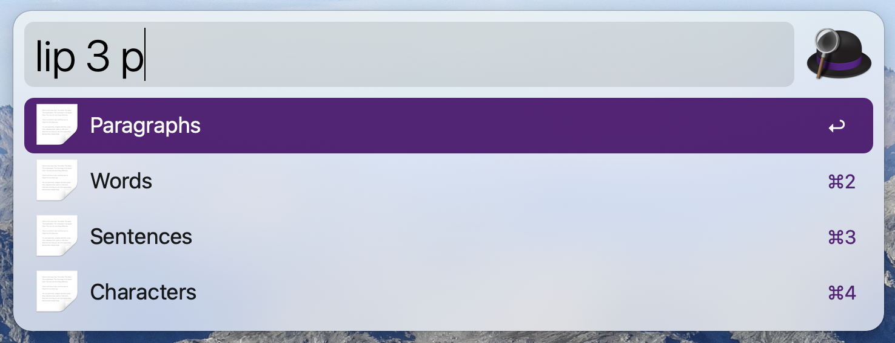

# Alfred Lipsum Workflow

An [Alfred 4](https://www.alfredapp.com/) workflow for generating [lorem ipsum](https://en.wikipedia.org/wiki/Lorem_ipsum) dummy text using [joshtronic/php-loremipsum](https://github.com/joshtronic/php-loremipsum).

## Installation

1. [Download the workflow](https://github.com/MGHollander/alfred-lipsum-workflow/releases/latest)
2. Double click the `.alfredworkflow` file to install

Note that the [Alfred Powerpack](https://www.alfredapp.com/powerpack/) is required to use workflows.

## Usage

1. Use the keyword `lip` to trigger the workflow.
2. Select format you want to generate (characters, words, sentences, or paragraphs).
3. (Optional) Add [options](#options) to the format you would like to generate.
4. Press `enter` to copy to clipboard and paste into the forefront application.

### Options

There are multiple options to enhance the output.

| Option | Usage | Description |
| --- | --- | --- |
| length (default is 1) | `lip 5` | Generates 5 instances of the format you have chosen |
| tags (default is no tags) | `lip 5 p` | Generates 5 instances of the format you have chosen and wraps each instance in a [
 tag](https://developer.mozilla.org/en-US/docs/Web/HTML/Element/p). You can wrap an instance in multiple tags by comma separating the tags like `lip 5 div,p`. |
| array (default is false) | `lip 5 p true` | Generates 5 instances of the format you have chosen, wraps each instance in a [
 tag](https://developer.mozilla.org/en-US/docs/Web/HTML/Element/p) and outputs it as a PHP array with a value for each instance. You can set the tags to `false` or `0` if you do not want to wrap the output into tags. |

## Developer notes

- The [joshtronic/php-loremipsum](https://github.com/joshtronic/php-loremipsum) copy in this project is slightly changed. The `output` method is made public to be able to use the tags and array options with characters as well.

## Roadmap

If there are enhancements that I would like to add, then I will add them as [issues in the repository](https://github.com/MGHollander/alfred-lipsum-workflow/issues).

## Feedback

Please feel free to give feedback, share ideas or report bugs. Email me at marc [at] mghollander [dot] nl or [add an issue](https://github.com/MGHollander/alfred-lipsum-workflow/issues).

## Donate

I work on this extension in my free time, but you can support me by making a donation (or buy me a beer) via <https://paypal.me/mghollander>.

## Credits

Forked from [alexchantastic/alfred-lipsum-workflow](https://github.com/alexchantastic/alfred-lipsum-workflow)
